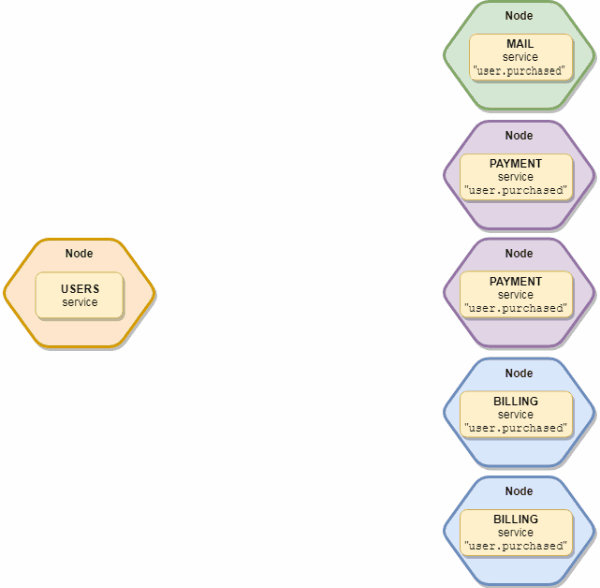

# saas-message-broker
Message broker used for event-driven architecture. Facilitates collaboration between our services.

<br />

<p align="center">

</p>

## Example usage

### 1) Create an Event
```java
public class AssetShared extends Event {
    
    private String assetName;

    public AssetShared(String assetName) {
        this.assetName = assetName;
    }
    
    @Override
    public String getName() {
        return "ASSET_SHARED";
    }

    @Override
    public int getVersion() {
        return 1;
    }
    
    @Override
    public Map<String, Object> getPayload() {
        Map<String, Object> payload = new HashMap<>();
        payload.put("assetName", assetName);
        return payload;
    }
    
    @Override
    public void createFromPayload(Map<String, Object> payload) {
        assetName = (String) payload.get("assetName");
    }
}
```
<br />


### 2) Create an EventMessageConsumer. Add the Event class to the EventProcessMapper passed into the consumer's constructor
```java
public class SendEmailNotification extends EventMessageConsumer {
    
    public SendEmailNotification() {
        super(
            new EventProcessMapper(AssetShared.class, null)
        );
    }
}
```
<br />

### 3) Implement an EventProcessor in order to process that event type (AssetShared)
```java
public class AssetSharedEmailNotificationService implements EventProcessor<AssetShared> {

        public void processEvent(AssetShared assetShared) {
                /**
                 * Receive asset shared event and send an email here 
                 */
        }
}
```
<br />

### 4) Add the EventProcessor as the second parameter to the EventProcessMapper. That's it!

```java
public class SendEmailNotification extends EventMessageConsumer {
    
    @Autowired
    public SendEmailNotification(AssetSharedEmailNotificationService assetSharedEmailNotificationService) {
        super(
            new EventProcessMapper(AssetShared.class, assetSharedEmailNotificationService)
        );
    }
}
```

<br />


🎉 The EventProcessor.processEvent() method will now be called every time the AssetShared event is published.

<br />

### Feel free to add more events and consumers to perform multiple actions per event!

```java
public class SendEmailNotification extends EventMessageConsumer {
    
    @Autowired
    public SendEmailNotification(
            AssetSharedEmailNotificationService assetSharedEmailNotificationService,
            CompanyCreatedEmailNotificationService companyCreatedEmailNotificationService,
            UserDeletedEmailNotificationService userDeletedEmailNotificationService
    ) {
        super(
            new EventProcessMapper(AssetShared.class, assetSharedEmailNotificationService),
            new EventProcessMapper(CompanyCreated.class, companyCreatedEmailNotificationService),
            new EventProcessMapper(UserDeleted.class, userDeletedEmailNotificationService)
        );
    }
}

public class SendTextNotification extends EventMessageConsumer {
    
    @Autowired
    public SendEmailNotification(AssetSharedTextNotificationService assetSharedTextNotificationService) {
        super(
            new EventProcessMapper(AssetShared.class, assetSharedTextNotificationService)
        );
    }
}

public class SendPushNotification extends EventMessageConsumer {
    
    @Autowired
    public SendPushNotification(AssetSharedPushNotificationService assetSharedPushNotificationService) {
        super(
            new EventProcessMapper(AssetShared.class, assetSharedPushNotificationService)
        );
    }
}
```

<br />


## To publish an event, simply create an instance of the event and call publishEvent().
<br />

```java
UserCreated event = new UserCreated();

MessageBroker.getInstance().publishEvent(event);
```
<br />

🎉 All microservices listening to that event will now be notified
